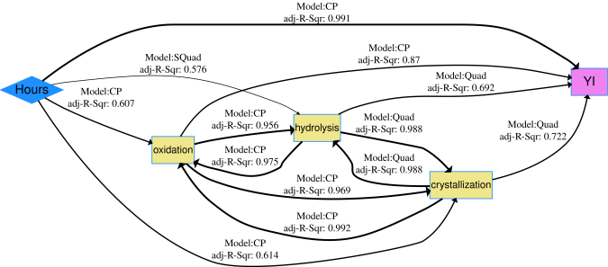
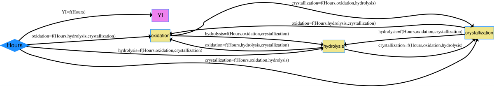

Data Description
-----------------------------------
A backsheet is a polymeric cover for the back (air side) of a photovoltaic (PV) module  (or solar panel) and is designed to protect the inner components of module. 
Typical backsheets consist of three layers of polymers to protect human beings from electrical shock and to control diffusion of water and oxygen into the module.  
It is critical that your solar panel has a backsheet that is of high quality and can withstand various environmental elements for the 25, 30 or longer years of its lifetime. 
Polyethylene terephthalate (PET) is an important material due to it high dielectric breakdown strength, and it the main core layer material in PV backsheets, and is also used as the air side (outer layer) polymer of some backsheets. 
However, PET based Backsheets are highly susceptible to moisture and ultraviolet (UV) irradiance. 
Degradation of backsheets will causes severe safety hazards and concomitant economic losses. 

Indoor accelerated exposures are used to study backsheet degradation within short exposure times so as to predict the performance of backsheets exposed to the real world exposure conditions. 
Backsheet degradation can be characterized by measurement of the change of the yellowness index (YI), which represents the color of a polymer and is associated with chemical changes and degradation due to irradiance, high temperature and other processes. 

Increased YI of a PV module backsheet can also indirectly lead to reduced power output and module efficiency: 1) the yellowing of backsheets indicates backsheet degradation, which may result in formation of cracks or delamination, allowing increased moisture ingress and increased degradation of EVA or metalization, leading to power loss, and 2) the yellowing of backsheet can increase the module temperature, which also would reduce the module efficiency.
Fourier-transform infrared spectroscopy (FTIR) is an effective method to study the chemical change of polymers. 
This non-destructive measurement enables researchers to obtain qualitative information about polymer functional groups and the relative amount of each group in the sample.

In this example, a dataset containing the YI of PET based backsheets ( with a laminate structure of (air side)-PET/PET/EVA-(sun side)) exposed to 1,500 hours of Damp Heat with no irradiance and a relative humidity of 85\% and a chamber temperature of 85$^\circ$C. 
The PET samples were removed from the exposure chamber every 500 hours and the YI measurement was conducted at every one of these time steps. 
The stressor variable is exposure time with unit of hour. 
Mechanistic variables from FTIR are included to track chemical changes in the materials related to 1) polymer chain scission due to hydrolysis, 2) crystallinity change and 3) oxidation.


Load data and run code to build netSEM 
------------------------------------------
```{r, message=FALSE, eval=FALSE}

## Load the backsheet data set
data(backsheet)

## Run netSEMp1 model
ans1 <- netSEMp1(backsheet)
## Plot the network model for principle 1
plot(ans1, cutoff = c(0.3, 0.6, 0.9))

## Run netSEMp2 model
ans2 <- netSEMp2(backsheet)
## Plot the network model for principle 2
plot(ans2, cutoff = c(0.3, 0.6, 0.9))


```

Network diagram for data
--------------------------

```{r, out.width="675px", echo=FALSE, fig.cap="Backsheet netSEMp1 model"}

```

```{r, out.width="800px", echo=FALSE, fig.cap="Backsheet netSEMp2 model"}

```


"Hours" is the endogenous stressor (S) variable and all other variables are considered as exogenous with YI as the response (R) and FTIR peaks as the mechanistic (M) variables. 
Based on the netSEM network diagram, "oxidation", which represents the formation of conjugated or aromatic structures due to oxidation, has the highest correlation with PET yellowing. 
The reason for this is that the conjugated structures formed have UV absorption at longer wavelengths than the fundamental absorption edge of PET.  
UV light absorbed by PET leads to the formation of chromophores, the conjugated moieties, and the PET starts to show yellow color.
Strong relationships between all mechanistic variables are also observed in terms of the $adj. R^2$, which illustrates that these degradation mechanisms are active, and are connected along a degradation pathway, shown in the network model. 

However, the degradation pathways including mechanistic variables have relative low adjusted $R^2$. 
This may indicate the complexity of PET degradation. 


Reference
--------------------------
Edge, M., R. Wiles, N. S. Allen, W. A. McDonald, and S. V. Mortlock. "Characterisation of the Species Responsible for Yellowing in Melt Degraded Aromatic Polyesters-I: Yellowing of Poly(Ethylene Terephthalate)." Polymer Degradation and Stability 53, no. 2 (August 1, 1996): 141-51. https://doi.org/10.1016/0141-3910(96)00081-X.

Gok, Abdulkerim, David K. Ngendahimana, Cara L. Fagerholm, Roger H. French, Jiayang Sun, and Laura S. Bruckman. "Predictive Models of Poly(Ethylene-Terephthalate) Film Degradation under Multi-Factor Accelerated Weathering Exposures." PLOS ONE 12, no. 5 (May 12, 2017): e0177614. https://doi.org/10.1371/journal.pone.0177614.


Acknowledgment
--------------------------
This material is based upon work supported by the Department of Energy, Office of Energy Efficiency and Renewable Energy (EERE), under Award Number DE-EE-007143.

