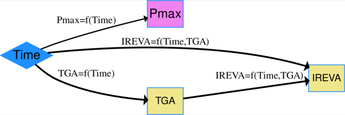

Data Description
-----------------------------------


In this example, full size PV modules were exposed to damp heat conditions (relative humidity of 85\% and a chamber temperature of 85$^\circ$C) for 4000 hours and the degradation in PV power output was measured at specific time intervals, or time steps.  
      In addition, some modules were withdrawn from the study at these time steps, to produce a retained sample library with samples available for each time step. 
      These retained samples were dismantled destructively in order to determine the changes occurred in the module materials. 
      In the resulting netSEM model, time was used as a proxy for damp heat exposure stress ($S$) variable and $P_{max}$ (maximum power generated by the modules) was used as the performance level response ($R$) variable, several mechanistic variables ($M$) were obtained through chemical evaluation methods, including FTIR and TGA  on EVA encapsulant. 
      This example also demonstrate how to add latent variables. 

Load data and run code to build netSEM 
------------------------------------------
```{r, message=FALSE, eval=FALSE}

## Load the pv module data set
data(PVmodule)

## Run netSEMp1 model
ans1 <- netSEMp1(PVmodule, exogenous = "Time", endogenous = "Pmax")
#plot network model with latent variable
plot(ans1, style = F, cutoff = c(0.3, 0.6, 0.9), 
     latent=c('EVA_hyd', 'Hac'))

## Run netSEMp2 model
ans2 <- netSEMp2(PVmodule, exogenous = "Time", endogenous = "Pmax")
## Plot the network model for principle 2 
plot(ans2)
```


```{r, out.width="675px", echo=FALSE, fig.cap="PVmodule netSEMp1 model"}

```

```{r, out.width="675px", echo=FALSE, fig.cap="PVmodule netSEMp2 model"}

```

Network diagram for data
--------------------------
"Time" is the endogenous and all other variables are considered as exogenous. 
Latent variable $Hac$ is the formation of acetic acid measured through thermogravimetric analysis (TGA), latent variable $EVA\_hyd$ stands for EVA hydrolysis, which is tracked by infrared signal corresponding to that, noted by $IREVA$, and $P_{max}$ is the maximum power generated by the PV modules. 

The analysis revealed a main degradation pathways that was derived from the strong relationships between the applied stressor, the infrared spectra (IR) signals of the EVA encapsulant, and the amount of free acetic acid measured through TGA of EVA, indicating the hydrolysis of EVA polymer under damp heat conditions. 
The effect of these two mechanistic variables on the loss in $P_{max}$ suggested a path of EVA hydrolysis driven power loss in PV modules. 
      

Reference
--------------------------

Gok, Abdulkerim, David K. Ngendahimana, Cara L. Fagerholm, Roger H. French, Jiayang Sun, and Laura S. Bruckman. "Predictive Models of Poly(Ethylene-Terephthalate) Film Degradation under Multi-Factor Accelerated Weathering Exposures." PLOS ONE 12, no. 5 (May 12, 2017): e0177614. https://doi.org/10.1371/journal.pone.0177614.


Acknowledgment
--------------------------
This material is based upon work supported by the Department of Energy, Office of Energy Efficiency and Renewable Energy (EERE), under Award Number DE-EE-007140.

