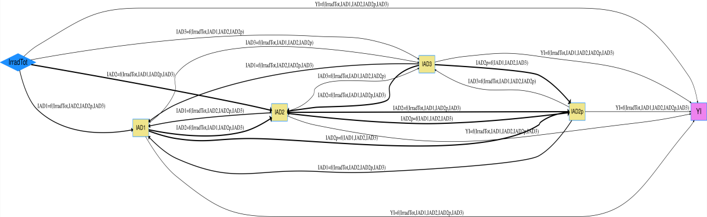

## Data Description

The data set is a study of photodegradation of acrylic polymer. In this work, polymeric samples were exposed to different levels of light exposures and resulting optical changes were determined through optical spectroscopy. *YI* (yellowness index) is the main endogenous variable and all other columns in the data set *IrradTot* (total applied irradiance), *IAD1*, *IAD2*, *IAD2p*, and *IAD3* are considered as exogenous variables, with fully consideration of the nonrecursive "feedback loop" relations.

## Load data and run code to build netSEM

```{r, message=FALSE, eval=FALSE}

## Load the acrylic data set
data(acrylic)
?acrylic

## Run netSEMp1 model
ans1 <- netSEMp1(acrylic, exogenous = "IrradTot", endogenous = "YI")
## Plot the network model for principle 1 
plot(ans1, cutoff = c(0.3,0.6,0.9))

## Run netSEMp2 model
ans2 <- netSEMp2(acrylic, exogenous = "IrradTot", endogenous = "YI")
## Plot the network model for principle 2 
plot(ans2, cutoff = c(0.3,0.6,0.9))
```

## Network diagram for data

```{r, out.width="675px", echo=FALSE, fig.cap="Acrylic netSEMp1 model"}

```

```{r, out.width="800px", echo=FALSE, fig.cap="Acrylic netSEMp2 model"}

```

## Reference

Myles P. Murray, Laura S. Bruckman, and Roger H. French "Photodegradation in a stress and response framework: poly(methyl methacrylate) for solar mirrors and lens," Journal of Photonics for Energy 2(1), 022004 (19 November 2012). <https://doi.org/10.1117/1.JPE.2.022004>
